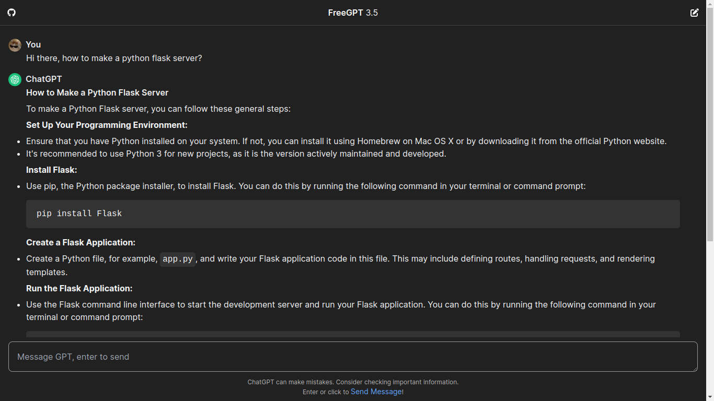

> [!WARNING]
> FreeGPT.js/this project is not affiliated with ChatGPT in any kind. I'm not responsible for anything and this project is just for educational purposes.

 <h1>FreeGPT.js</h1>
 
 **🤖 A great, stable but free ChatGPT library with no authentication at all!**

[](https://github.com/ashishagarwal2023/freegptjs/stargazers) [](https://github.com/ashishagarwal2023/freegptjs/blob/main/LICENSE.md) [](https://github.com/ashishagarwal2023/freegptjs/commits/main)

> [!TIP]
> If you are looking for a template or example, go ahead and look the branch **react**. It uses Next.js with FreeGPT.js to make a simple, but working, great and free unlimited chat application.
> Or you can checkout my ChatGPT UI Clone + Implementation: [ChatGPT Clone with Next.js and FreeGPT.js][https://ashishagarwal.is-a.dev/chatgpt-clone/]

> Give it a try! Go [here](https://ashishagarwal.is-a.dev/chatgpt-clone) to test the FreeGPT.js out! It's free!

<div id="intro">

## 💡 About

</div>

freegpt is a powerful javascript library you can use to get ChatGPT on your website, and its free!

- Simple, just one function
- Open-source, free
- Easy-to-use
- Lightweight (yet optimally performant)
- No authentication, free for all
- Unlimited GPT 3.5 Model

<div id="importing">

## Examples
Just one yet, but this list can be filled.

[ChatGPT Clone with Next.js and FreeGPT.js](https://ashishagarwal.is-a.dev/chatgpt-clone/)


You built something **cool**? Make a issue or PR!

## ⚡ Adding the library

</div>

Load `https://cdn.jsdelivr.net/gh/ashishagarwal2023/freegpt.js.org@master/src/freegpt.js` as a script in your `<head>` and call it after its loaded.

```html
<script src="https://cdn.jsdelivr.net/gh/ashishagarwal2023/freegpt.js.org@master/src/freegpt.js"></script>
```

> Load the freegpt lib the same way in your <head> in your layout of Next/React project, then use `await gpt.ask` to see if it works. If `gpt.ask` is not defined (probably when using with Nodejs), try `window.gpt.ask`. The library will only work on client-side.

## 💻 Usage

```js
(async () => {
  let response = await gpt.ask("Explain variables in javascript");
  console.log(response); // you got it!
})();
```

And that is all.

> [!IMPORTANT]
> If you are receiving error even when library is loaded (probably with React, and might also with Vue, Angular, etc), then use `window.gpt.ask` instead of `gpt.ask`.
> And next thing, the `window.gpt.ask` is only available on client-side components, as you may know.

## 🤖 Why client-side?

This is a reverse-engineer of a ChatGPT AI service, [You.com](https://you.com).

They, for their own security, added Cloudflare Protection to the API. This can only be bypassed on JavaScript client-side.

> Please do not make issues regarding not working with Nodejs like #1

### Why I just made it?

Building AI applications isn't free, but I wanted to do it. This does not cost me a penny, feel free to use!

Give it a star if you want to help me keep it active.

It depends on **You.com**'s API, however its reverse engineered. Please note that I'm not responsible for anything and this is just for educational purpose.s

## 🤝Contributing

You are welcome! I'm looking for some cool peoples to help me push this project further!

> I'm currently in-active on this project but you could, if you wish, try to implement conversations! :D

PRs are welcome, good issues too!
